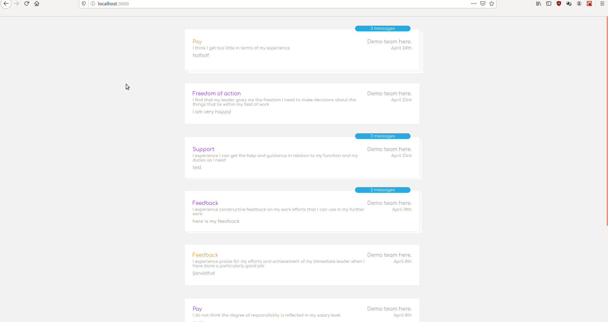
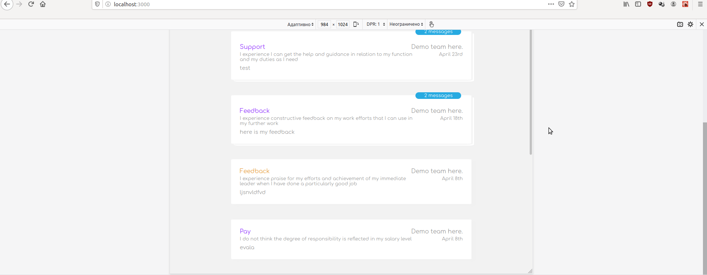

Welcome to my litte exercise in Frontend Development.

This is a threads example using React, json-server and sass. Developed and tested mainly in Firefox.

Please enjoy.

## Getting Started

### Clone the repo
Run in the terminal: `git clone https://github.com/GeorgiSTodorov/Threads.git`

### Open the folder
`cd Threads`

### Install the dependencies
`npm install`

### Start the project
`npm start`

The project should autmatically open at [port 3000](http://localhost:3000/), while the json-server is running at [port 3001](http://localhost:3001/threads).

This project was bootstrapped with [Create React App](https://github.com/facebook/create-react-app).
